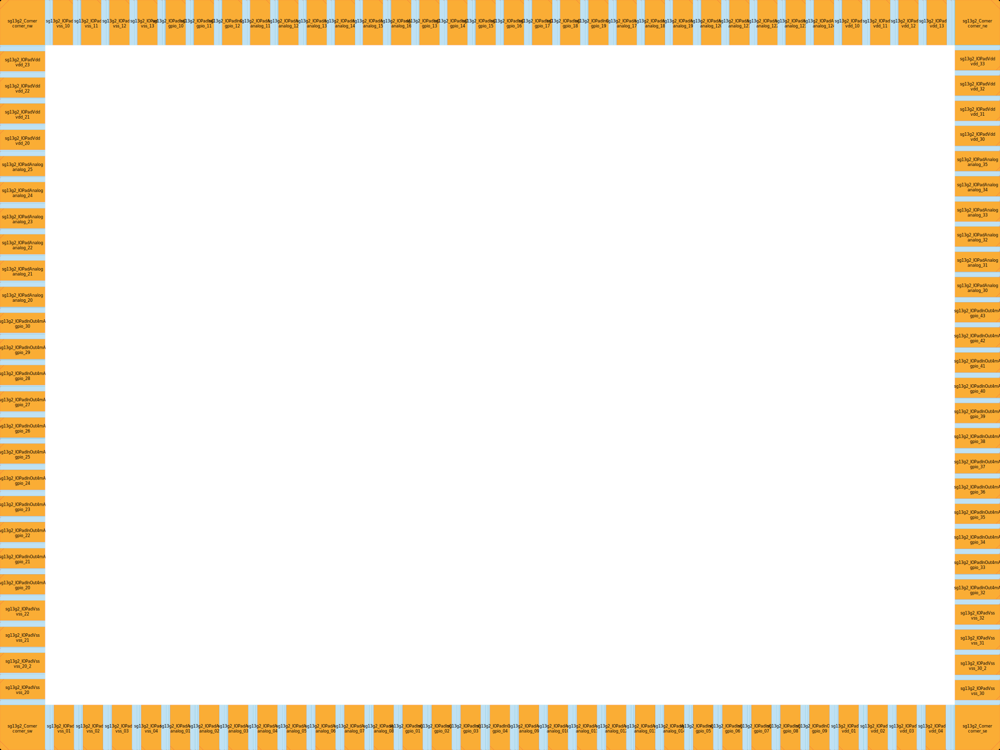
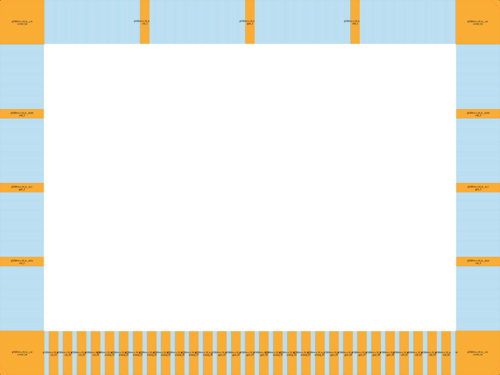

# IO-Ring Master

Welcome to the example-reference repository for creating and documenting IO (Input-Output) cells.

Below you can see some examples generated using YOSYS/Padring tool and klayout:

## Repository Structure
* `scripts/` -  code for synthesising io-ring for respective open pdks.
* `build/` - build results.
* `document/` - Technical cell documentation for respective pdk.
* `lef/` - Custom merged lef definition for easy use.

### SG130 from IHP


### GF180 from Global Foundaries

# SVG Block Diagram (LEF)



## Documentation
Full details on the IO padring cells can be found here:
* [IO Cell Library Reference](document/gf180/gf180_cells.md)


# Usage
# Build System Documentation

This project uses a `Makefile` to automate the generation of padrings and GDS merging for IHP SG13G2 and GF180MCU technologies.

## 1. Environment Configuration
Before running the build, ensure the following variables in the `Makefile` match your local environment.

| Variable | Default Value | Description |
| :--- | :--- | :--- |
| **`PDK_ROOT`** | `/home/tulpar/vlsi/pdk` | **(Crucial)** The root directory containing your PDKs. Update this if your PDKs are installed elsewhere. |
| **`PADRING_BIN`** | `padring` | The command or path to the [Padring](https://github.com/YosysHQ/padring) executable. |
| **`KLAYOUT_BIN`** | `klayout` | The command or path to the [KLayout](https://www.klayout.de/) executable. |
| `IHP_IO_LEF` | `$(PDK_ROOT)/.../sg13g2_io.lef` | Path to the IHP IO Library Exchange Format (LEF) file. |
| `GF180_IO_LEF` | `./lef/gf180/gf180_io_merged.lef` | Path to the merged GF180 IO LEF file. |

## 2. Build Commands

This document explains the commands and variables used in the `Makefile` to automate the build process for IHP SG13G2 and GF180MCU technologies.

### Target: `make sg130`
Builds the layout for the IHP SG13G2 technology.

1.  **Create Directory:**
    `mkdir -p build/sg130`
    * Creates the build output folder.

2.  **Generate Padring:**
    ```bash
    $(PADRING_BIN) \
        --lef $(IHP_IO_LEF) \
        --svg build/sg130/sg130.svg \
        --def build/sg130/sg130.def \
        -o build/sg130/sg130.gds \
        scripts/sg130/sg130.config
    ```
    * Generates the IO ring geometry (GDS), placement data (DEF), and a visual preview (SVG) based on the config file.

3.  **Merge GDS:**
    `$(KLAYOUT_BIN) -z -r scripts/sg130/merge_sg130.py`
    * Runs a KLayout Python script in batch mode (`-z`) to merge the generated padring with the core design.

---

### Target: `make gf180`
Builds the layout for the GlobalFoundries 180nm technology and generates a PNG preview.

1.  **Create Directory:**
    `mkdir -p build/gf180`
    * Creates the build output folder.

2.  **Generate Padring:**
    ```bash
    $(PADRING_BIN) \
        --lef $(GF180_IO_LEF) \
        --svg build/gf180/gf180.svg \
        --def build/gf180/gf180.def \
        -o build/gf180/gf180.gds \
        scripts/gf180/gf180.config
    ```
    * Generates the IO ring geometry, DEF, and SVG using the GF180 LEF and config.

3.  **Merge GDS:**
    `$(KLAYOUT_BIN) -z -r scripts/gf180/merge_gf180.py`
    * Runs the headless KLayout merge script for GF180.

4.  **Generate PNG Image:**
    ```bash
    $(KLAYOUT_BIN) -b -r scripts/gf180/png.py \
        -rd input_file=build/gf180/gf180_final.gds \
        -rd output_file=build/gf180/gf180_final.png
    ```
    * Runs the `png.py` script in batch mode.
    * `input_file`: Passes the final merged GDS path to the script.
    * `output_file`: Sets the destination for the PNG image.

---

### Target: `make clean`
Cleans up the workspace.

* **Command:** `rm -f -r build/*`
* **Action:** Recursively force-deletes all files and subdirectories inside the `build/` folder.
